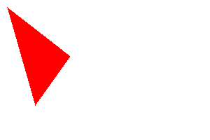

# 基礎プログラミングおよび演習レポート ＃05
* 学籍番号: 2291029
* 氏名: 中村凜
* ペア学籍番号・氏名(または「個人作業」): 個人作業
* 提出日付: 2022/11/10

# [課題の再掲]
## 演習3
次のような手続きを追加して円以外の図形を塗ってみよ。

c. 三角形を塗るメソッド。

# [プログラム・実行例とその説明]
## sample3.rb
```Ruby
Pixel = Struct.new(:r, :g, :b)
$img = Array.new(200) do
  Array.new(300) { Pixel.new(255, 255, 255) }
end
def pset(x, y, r, g, b)
  if 0 <= x && x < 300 && 0 <= y && y < 200
    $img[y][x].r = r; $img[y][x].g = g; $img[y][x].b = b
  end
end

def writeimage(name)
  open('t3/' + name, 'wb') do |f|
    f.puts("P6\n300 200\n255")
    $img.each do |a|
      a.each { |p| f.write(p.to_a.pack('ccc')) }
    end
  end
end

def fillTriangle(x1, y1, x2, y2, x3, y3, r, g, b)
	x0 = (x1+x2+x3).to_f/3
	y0 = (y1+y2+y3).to_f/3
	
	a1 = (y1 - y2).to_f / (x1 - x2)
	b1 = y1.to_f - a1 * x1
	line1 = 1
	if y0 >= (a1 * x0 + b1) then; line1 = -1; end

	a2 = (y2 - y3).to_f / (x2 - x3)
	b2 = y2.to_f - a2 * x2
	line2 = 1
	if y0 >= (a2 * x0 + b2) then; line2 = -1; end

	a3 = (y3 - y1).to_f / (x3 - x1)
	b3 = y3.to_f - a3 * x3
	line3 = 1
	if y0 >= (a3 * x0 + b3) then; line3 = -1; end
	200.times do |y|
		300.times do |x|
			if (y * line1 <= (a1 * x + b1) * line1) & (y * line2 <= (a2 * x + b2) * line2) & (y * line3 <= (a3 * x + b3) * line3)
				pset(x, y, r, g, b)
			end
		end
	end
end
def mypictureC
	fillTriangle(10, 10, 100, 80, 50, 150, 255, 0, 0)
	writeimage('t3_C.ppm')
end

mypictureC
```

## 出力された画像ファイル


18行目までの`Pixel`の定義、画像用バッファの作成、`pset`メソッドの定義まではテキストのものと同じなので説明を割愛する。

今回の#5のレッスンでは多くの画像ファイルを生成するため、それぞれの演習ごとにフォルダとして分けた。そのため`writeimage`メソッドでは`open`メソッドに渡すファイルパスに`"t3/"`という文字列を追加した。
これによりいくつもに生成された画像をフォルダで分けることができた。

そして`fillTriangle`メソッドは第一から第六引数までに与えられた座標を頂点とする第七から第九引数で与えられた色で塗りつぶされた三角形を出力する。

手法としては、それぞれの辺の一次関数を求めて不等式にし、それらをすべて満たす領域に描画するという方法で描画しようとした。しかし、求めるべき領域がそれぞれの一次関数よりもy方向に大きいか小さいかで不等式を変える必要があった。

そこで、三角形の重心の座標を求めてそれを`x0`, `y0`へと代入し、重心がそれぞれの１次関数絡みてy方向に大きいか小さいかを判別した。そしてその結果をそれぞれ`line1`, `line2`, `line3`に重心がy方向にみて大きいならば-1, それ以外ならば1を代入した。

そして、条件式の不等式のところで左辺、右辺に`line1`, `line2`, `line3`をそれぞれに乗ずることで、-1が代入されていた場合は不等式の大小を反転させることができる。その条件式に合う座標に`pset`メソッドで点を出力する。

# [課題に対する報告]
2次元配列・レコードを適切に使用して画像を表現し、様々な形を描画することができた。

# [考察]
`fillTriangle`メソッドの引数が現状九つあり、非常に保守性が低い状態にある。座標や色をvalueオブジェクトなどや構造体にして分離する事が必要だ。

# [アンケート]
## Q1.簡単なものなら自分が思った画像が作れますか。
作れます。特に数学的な画像は作りやすかった。 

## Q2. うまく画像を作り出すコツは何だと思いますか。
複雑な画像を直接すべての座標を指定してもいいが、面倒なので数学的なモデルに落とし込むことが重要だと思う。

## Q3. リフレクション(今回の課題で分かったこと)・感想・要望をどうぞ。
今回はreplitというブラウザでのIDEを使ってプログラムを作ったが、演習1から演習4までのプログラムがすべて完成したところでgithubと連携しようとしたところ、データがすべて消えた。他にも色々プログラムを作っていたのだが、結果的にアルゴリズムを覚えていた三角形の塗りつぶしのみ作り直した。どうやらgithubと連携しようとするとgithubのリポジトリのファイルが優先されるようなので、次回から連携する際は大人しくファイルを一度ダウンロードし、vscode上でコミットするようにするべきだ。